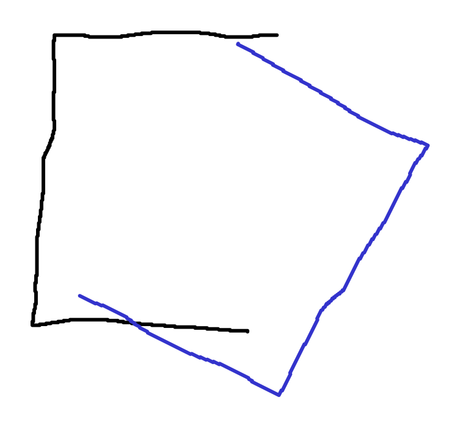
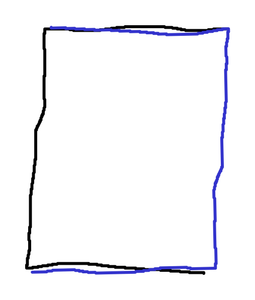

# Aufgabe 4

## a)
Die Laserscans müssen korrespondierende Punkte enthalten. Der Roboter darf also z. B. nicht zu schnell fahren oder rotieren bzw. zu selten Scannen oder zu plötzlich seine Pose verändern (z. B. irgendwie runter fallen oder sich teleportieren).
    Es dürfen nicht zu viele Bewegliche Dinge in dem Scanbereich vorhanden sein. Ist der Roboter z. B. in einem Raum mit vielen Personen, die sich bewegen, so wird es schwer die Scans richtig zu matchen.
    Die Scans müssen eine gewisse Art von Veränderung aufweisen. Scannt ein Roboter z. B. in einem langen fast komplett symmetrischen Gang, so ist es für diesen nicht möglich mithilfe des Scans festzustellen, dass dieser sich bewegt, da die Scans einfach immer nur "aufeinander" und nicht "aneinander" gematched werden.

## b)
ICP matched immer mit dem nächsten Nachbarn. Hat ICP nun schon ein recht gutes Ergebnis gefunden und würden weitere Transformationen das Ergebnis zuerst nur verschlechtern, so würde diese nicht weiter betrachtet. \
Liegt z. B. solche Scans vor:

  

so würde wahrscheinlich ICP wie folgt matchen:

  

obwohl der Scan nur zu dem vorherigen rotiert wurde und somit eigentlich ein "perfektes" Match gefunden werden könnte.  

## c)
Man könnte zum Beispiel mit Linien und/oder markanten Eigenschaften matchen. So könnte man z. B. einen Linienfilter auf den Scan anwenden und dann die dabei entstandenen Linien matchen (Lokalisierung an Linien). Dies funktioniert aber nur Sinn, wenn es auch genug markante Linien gibt.
Ebenso könnte man Eigenschaften im Scan (wie auch z. B. durch Linien entstandene Ecken) matchen und damit die Korrespondenzen ermitteln.

## d)
Da ein Scan häufig Rauschen enthält, könnte man zuerst einen Filter wie z. B. den Medianfilter anwenden um dieses zu minimieren. Dadurch könnte der ermittelte Fehler konstanter sein, was dazu führt, dass das Konvergieren etwas geradliniger und somit ggf. auch schneller verläuft
Oder wie bereits in der Aufgabe zuvor beschrieben, lässt sich ein Linienfilter anwenden um eine etwas andere Ausführung von ICP zu erhalten