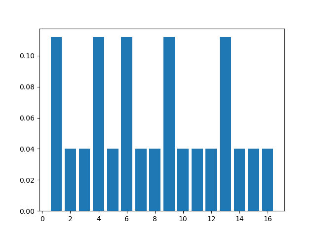
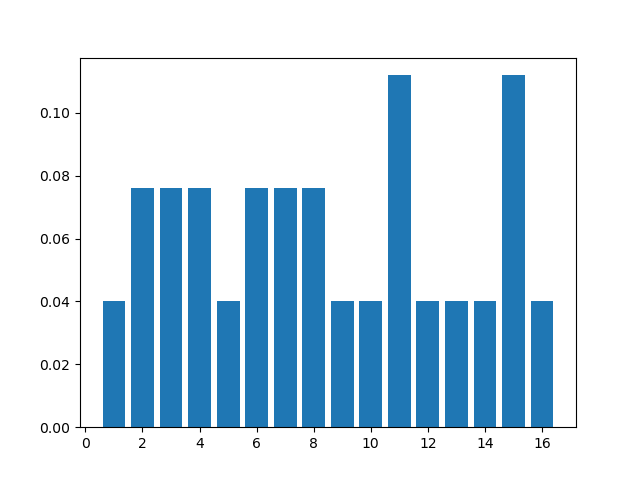
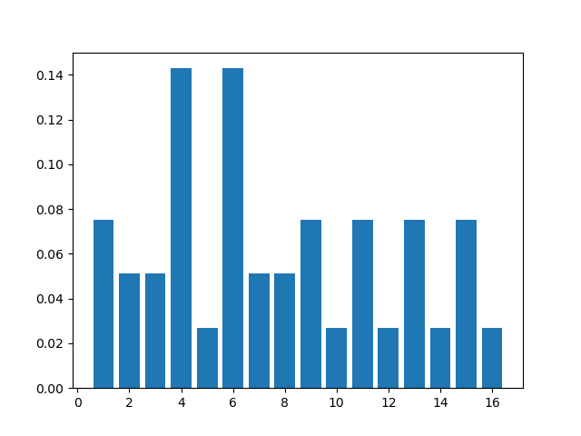
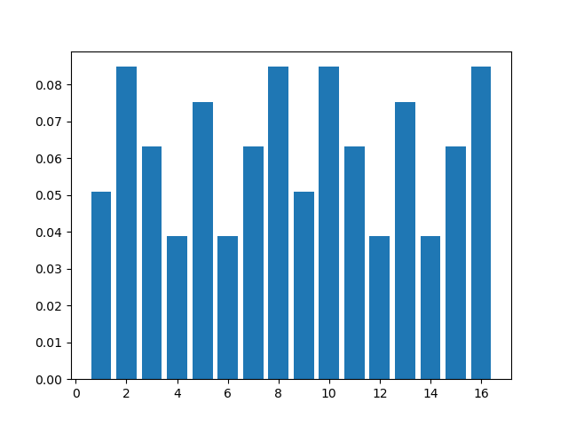
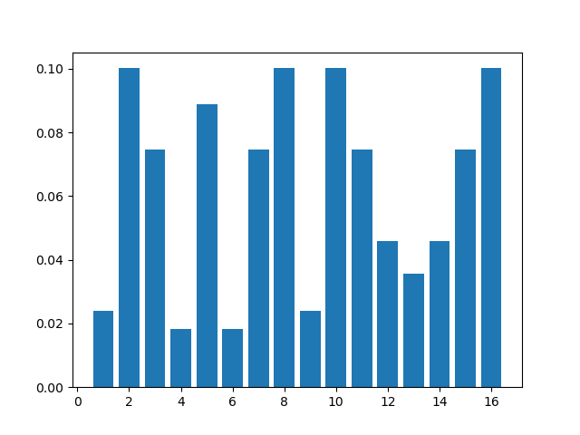

# Aufgabe 1

## A)

### Initialisierung

Initialisiere alle Aufenthaltswahrscheinlichkeiten für die einzelnen Felder mit einer gleichverteilten Wahrscheinlichkeit von 1/16. Dabei wird der erste Eintrag des Vektors als Feld 1, der zweite als Feld 2 usw. interpretiert:  
$$ V_{t0}= \begin{bmatrix}
0.0625 \\
0.0625 \\
0.0625 \\
0.0625 \\
0.0625 \\
0.0625 \\
0.0625 \\
0.0625 \\
0.0625 \\
0.0625 \\
0.0625 \\
0.0625 \\
0.0625 \\
0.0625 \\
0.0625 \\
0.0625
\end{bmatrix} $$

### Schritt 1 - Eine Landmarke ###

Multipliziere jeden Eintrag, auf welchem eine Landmarke steht mit 0.7 und jeden Eintrag auf welchem keine Landmarke steht mit 0.25.

$$ 
\text{Matrix Landmarke}
\newline
M_{L}=\begin{bmatrix}
0.7 & 0 & 0 & 0 & 0 & 0 & 0 & 0 & 0 & 0 & 0 & 0 & 0 & 0 & 0 & 0 \\
0 & 0.25 & 0 & 0 & 0 & 0 & 0 & 0 & 0 & 0 & 0 & 0 & 0 & 0 & 0 & 0 \\
0 & 0 & 0.25 & 0 & 0 & 0 & 0 & 0 & 0 & 0 & 0 & 0 & 0 & 0 & 0 & 0 \\
0 & 0 & 0 & 0.7 & 0 & 0 & 0 & 0 & 0 & 0 & 0 & 0 & 0 & 0 & 0 & 0 \\
0 & 0 & 0 & 0 & 0.25 & 0 & 0 & 0 & 0 & 0 & 0 & 0 & 0 & 0 & 0 & 0 \\
0 & 0 & 0 & 0 & 0 & 0.7 & 0 & 0 & 0 & 0 & 0 & 0 & 0 & 0 & 0 & 0 \\
0 & 0 & 0 & 0 & 0 & 0 & 0.25 & 0 & 0 & 0 & 0 & 0 & 0 & 0 & 0 & 0 \\
0 & 0 & 0 & 0 & 0 & 0 & 0 & 0.25 & 0 & 0 & 0 & 0 & 0 & 0 & 0 & 0 \\
0 & 0 & 0 & 0 & 0 & 0 & 0 & 0 & 0.7 & 0 & 0 & 0 & 0 & 0 & 0 & 0 \\
0 & 0 & 0 & 0 & 0 & 0 & 0 & 0 & 0 & 0.25 & 0 & 0 & 0 & 0 & 0 & 0 \\
0 & 0 & 0 & 0 & 0 & 0 & 0 & 0 & 0 & 0 & 0.25 & 0 & 0 & 0 & 0 & 0 \\
0 & 0 & 0 & 0 & 0 & 0 & 0 & 0 & 0 & 0 & 0 & 0.25 & 0 & 0 & 0 & 0 \\
0 & 0 & 0 & 0 & 0 & 0 & 0 & 0 & 0 & 0 & 0 & 0 & 0.7 & 0 & 0 & 0 \\
0 & 0 & 0 & 0 & 0 & 0 & 0 & 0 & 0 & 0 & 0 & 0 & 0 & 0.25 & 0 & 0 \\
0 & 0 & 0 & 0 & 0 & 0 & 0 & 0 & 0 & 0 & 0 & 0 & 0 & 0 & 0.25 & 0 \\
0 & 0 & 0 & 0 & 0 & 0 & 0 & 0 & 0 & 0 & 0 & 0 & 0 & 0 & 0 & 0.25
\end{bmatrix}

\newline

\overline{V_{t1}} = M_{L} \cdot V_{t0} = \begin{bmatrix}
0.04375 \\
0.015625 \\
0.015625 \\
0.04375 \\
0.015625 \\
0.04375 \\
0.015625 \\
0.015625 \\
0.04375 \\
0.015625 \\
0.015625 \\
0.015625 \\
0.04375 \\
0.015625 \\
0.015625 \\
0.015625
\end{bmatrix} $$

Danach wird der Vektor normalisiert, sodass alle Wahrscheinlichkeiten addiert 1 ergeben. Der Normalisierungsfaktor lässt sich bestimmen, durch 1/SummeDerWahrscheinlichkeiten. Hier wäre dieser also 1/0.390625. Dann multipliziert man jeden Eintrag mit dem Normalisierungsfaktor um die Wahrscheinlichkeiten zu normalisieren. Daraus ergibt sich dann folgender Vektor:  
$$

\eta = 1 / \left| \overline{V_{t1}} \right| =  1/0.390625

\newline

V_{t1} = \eta \cdot \overline{V_{t1}} = \begin{bmatrix}
0.112 \\
0.04 \\
0.04 \\
0.112 \\
0.04 \\
0.112 \\
0.04 \\
0.04 \\
0.112 \\
0.04 \\
0.04 \\
0.04 \\
0.112 \\
0.04 \\
0.04 \\
0.04
\end{bmatrix}$$

### Schritt 2 - 2 Schritte im Uhrzeigersinn ###

Der Roboter bewegt sich zwei Zellen im Uhrzeigersinn, was bedeutet, dass die Wahrscheinlichkeiten in dem Vektor um je zwei Stellen weiter verschoben werden. Dies geschieht dabei dann 'im Kreis':  

$$

\text{Matrix 2 im Uhrzeigersinn}
\newline
M_{2U} = \begin{bmatrix}
0 & 0 & 1 & 0 & 0 & 0 & 0 & 0 & 0 & 0 & 0 & 0 & 0 & 0 & 0 & 0 \\
0 & 0 & 0 & 1 & 0 & 0 & 0 & 0 & 0 & 0 & 0 & 0 & 0 & 0 & 0 & 0 \\
0 & 0 & 0 & 0 & 1 & 0 & 0 & 0 & 0 & 0 & 0 & 0 & 0 & 0 & 0 & 0 \\
0 & 0 & 0 & 0 & 0 & 1 & 0 & 0 & 0 & 0 & 0 & 0 & 0 & 0 & 0 & 0 \\
0 & 0 & 0 & 0 & 0 & 0 & 1 & 0 & 0 & 0 & 0 & 0 & 0 & 0 & 0 & 0 \\
0 & 0 & 0 & 0 & 0 & 0 & 0 & 1 & 0 & 0 & 0 & 0 & 0 & 0 & 0 & 0 \\
0 & 0 & 0 & 0 & 0 & 0 & 0 & 0 & 1 & 0 & 0 & 0 & 0 & 0 & 0 & 0 \\
0 & 0 & 0 & 0 & 0 & 0 & 0 & 0 & 0 & 1 & 0 & 0 & 0 & 0 & 0 & 0 \\
0 & 0 & 0 & 0 & 0 & 0 & 0 & 0 & 0 & 0 & 1 & 0 & 0 & 0 & 0 & 0 \\
0 & 0 & 0 & 0 & 0 & 0 & 0 & 0 & 0 & 0 & 0 & 1 & 0 & 0 & 0 & 0 \\
0 & 0 & 0 & 0 & 0 & 0 & 0 & 0 & 0 & 0 & 0 & 0 & 1 & 0 & 0 & 0 \\
0 & 0 & 0 & 0 & 0 & 0 & 0 & 0 & 0 & 0 & 0 & 0 & 0 & 1 & 0 & 0 \\
0 & 0 & 0 & 0 & 0 & 0 & 0 & 0 & 0 & 0 & 0 & 0 & 0 & 0 & 1 & 0 \\
0 & 0 & 0 & 0 & 0 & 0 & 0 & 0 & 0 & 0 & 0 & 0 & 0 & 0 & 0 & 1 \\
1 & 0 & 0 & 0 & 0 & 0 & 0 & 0 & 0 & 0 & 0 & 0 & 0 & 0 & 0 & 0 \\
0 & 1 & 0 & 0 & 0 & 0 & 0 & 0 & 0 & 0 & 0 & 0 & 0 & 0 & 0 & 0
\end{bmatrix}

\newline

V_{t2} =  M_{2U} \cdot V_{t1} =

[0.04, 0.04, 0.112, 0.04, 0.04, 0.112, 0.04, 0.112, 0.04, 0.04, 0.112, 0.04, 0.04, 0.04, 0.112, 0.04]^T

$$

### Schritt 3 - Eine Landmarke ###

Multipliziere jeden Eintrag, auf welchem eine Landmarke steht mit 0.7 und jeden Eintrag auf welchem keine Landmarke steht mit 0.25.  

$$

\overline{V_{t3}} = M_{L} \cdot V_{t2} =
[0.028, 0.01, 0.028, 0.028, 0.01, 0.0784, 0.01, 0.028, 0.028, 0.01, 0.028, 0.01, 0.028, 0.01, 0.028, 0.01]^T

$$

Danach wird der Vektor normalisiert, sodass alle Wahrscheinlichkeiten addiert 1 ergeben:  

$$
\eta = 1 / \left| \overline{V_{t3}} \right|
\newline
V_{t3} = \eta \cdot \overline{V_{t3}} =
[0.0752, 0.0269, 0.0752, 0.0752, 0.0269, 0.2105, 0.0269, 0.0752, 0.0752, 0.0269, 0.0752, 0.0269, 0.0752, 0.0269, 0.0752, 0.0269]^T

$$

### Schritt 4 - 4 Schritte im Uhrzeigersinn ###

Der Roboter bewegt sich vier Zellen im Uhrzeigersinn, was bedeutet, dass die Wahrscheinlichkeiten in dem Vektor um je vier Stellen weiter verschoben werden. Dies geschieht dabei dann 'im Kreis':  

$$
\text{Matrix 4 im Uhrzeigersinn}
\newline
M_{4U} = \begin{bmatrix}
0 & 0 & 0 & 0 & 1 & 0 & 0 & 0 & 0 & 0 & 0 & 0 & 0 & 0 & 0 & 0 \\
0 & 0 & 0 & 0 & 0 & 1 & 0 & 0 & 0 & 0 & 0 & 0 & 0 & 0 & 0 & 0 \\
0 & 0 & 0 & 0 & 0 & 0 & 1 & 0 & 0 & 0 & 0 & 0 & 0 & 0 & 0 & 0 \\
0 & 0 & 0 & 0 & 0 & 0 & 0 & 1 & 0 & 0 & 0 & 0 & 0 & 0 & 0 & 0 \\
0 & 0 & 0 & 0 & 0 & 0 & 0 & 0 & 1 & 0 & 0 & 0 & 0 & 0 & 0 & 0 \\
0 & 0 & 0 & 0 & 0 & 0 & 0 & 0 & 0 & 1 & 0 & 0 & 0 & 0 & 0 & 0 \\
0 & 0 & 0 & 0 & 0 & 0 & 0 & 0 & 0 & 0 & 1 & 0 & 0 & 0 & 0 & 0 \\
0 & 0 & 0 & 0 & 0 & 0 & 0 & 0 & 0 & 0 & 0 & 1 & 0 & 0 & 0 & 0 \\
0 & 0 & 0 & 0 & 0 & 0 & 0 & 0 & 0 & 0 & 0 & 0 & 1 & 0 & 0 & 0 \\
0 & 0 & 0 & 0 & 0 & 0 & 0 & 0 & 0 & 0 & 0 & 0 & 0 & 1 & 0 & 0 \\
0 & 0 & 0 & 0 & 0 & 0 & 0 & 0 & 0 & 0 & 0 & 0 & 0 & 0 & 1 & 0 \\
0 & 0 & 0 & 0 & 0 & 0 & 0 & 0 & 0 & 0 & 0 & 0 & 0 & 0 & 0 & 1 \\
1 & 0 & 0 & 0 & 0 & 0 & 0 & 0 & 0 & 0 & 0 & 0 & 0 & 0 & 0 & 0 \\
0 & 1 & 0 & 0 & 0 & 0 & 0 & 0 & 0 & 0 & 0 & 0 & 0 & 0 & 0 & 0 \\
0 & 0 & 1 & 0 & 0 & 0 & 0 & 0 & 0 & 0 & 0 & 0 & 0 & 0 & 0 & 0 \\
0 & 0 & 0 & 1 & 0 & 0 & 0 & 0 & 0 & 0 & 0 & 0 & 0 & 0 & 0 & 0
\end{bmatrix}

\newline

V_{t4} =  M_{4U} \cdot V_{t3} =
[0.0752, 0.0269, 0.0752, 0.0269, 0.0752, 0.0269, 0.0752, 0.0752, 0.0269, 0.2105, 0.0269, 0.0752, 0.0752, 0.0269, 0.0752, 0.0269]^T

$$

### Schritt 5 - Keine Landmarke ###

Multipliziere jeden Eintrag, auf welchem eine Landmarke steht mit 0.3 und jeden Eintrag auf welchem keine Landmarke steht mit 0.75.

$$ 
\text{Matrix Keine Landmarke}
\newline
M_{KL}=\begin{bmatrix}
0.3 & 0 & 0 & 0 & 0 & 0 & 0 & 0 & 0 & 0 & 0 & 0 & 0 & 0 & 0 & 0 \\
0 & 0.75 & 0 & 0 & 0 & 0 & 0 & 0 & 0 & 0 & 0 & 0 & 0 & 0 & 0 & 0 \\
0 & 0 & 0.75 & 0 & 0 & 0 & 0 & 0 & 0 & 0 & 0 & 0 & 0 & 0 & 0 & 0 \\
0 & 0 & 0 & 0.3 & 0 & 0 & 0 & 0 & 0 & 0 & 0 & 0 & 0 & 0 & 0 & 0 \\
0 & 0 & 0 & 0 & 0.75 & 0 & 0 & 0 & 0 & 0 & 0 & 0 & 0 & 0 & 0 & 0 \\
0 & 0 & 0 & 0 & 0 & 0.3 & 0 & 0 & 0 & 0 & 0 & 0 & 0 & 0 & 0 & 0 \\
0 & 0 & 0 & 0 & 0 & 0 & 0.75 & 0 & 0 & 0 & 0 & 0 & 0 & 0 & 0 & 0 \\
0 & 0 & 0 & 0 & 0 & 0 & 0 & 0.75 & 0 & 0 & 0 & 0 & 0 & 0 & 0 & 0 \\
0 & 0 & 0 & 0 & 0 & 0 & 0 & 0 & 0.3 & 0 & 0 & 0 & 0 & 0 & 0 & 0 \\
0 & 0 & 0 & 0 & 0 & 0 & 0 & 0 & 0 & 0.75 & 0 & 0 & 0 & 0 & 0 & 0 \\
0 & 0 & 0 & 0 & 0 & 0 & 0 & 0 & 0 & 0 & 0.75 & 0 & 0 & 0 & 0 & 0 \\
0 & 0 & 0 & 0 & 0 & 0 & 0 & 0 & 0 & 0 & 0 & 0.75 & 0 & 0 & 0 & 0 \\
0 & 0 & 0 & 0 & 0 & 0 & 0 & 0 & 0 & 0 & 0 & 0 & 0.3 & 0 & 0 & 0 \\
0 & 0 & 0 & 0 & 0 & 0 & 0 & 0 & 0 & 0 & 0 & 0 & 0 & 0.75 & 0 & 0 \\
0 & 0 & 0 & 0 & 0 & 0 & 0 & 0 & 0 & 0 & 0 & 0 & 0 & 0 & 0.75 & 0 \\
0 & 0 & 0 & 0 & 0 & 0 & 0 & 0 & 0 & 0 & 0 & 0 & 0 & 0 & 0 & 0.75
\end{bmatrix}

\newline
\overline{V_{t5}} = M_{KL} \cdot V_{t4} =
\newline
[0.02256, 0.020175, 0.0564, 0.00807, 0.0564, 0.00807, 0.0564, 0.0564, 0.00807, 0.157875, 0.020175, 0.0564, 0.02256, 0.020175, 0.0564, 0.020175]^T

$$

Danach wird der Vektor normalisiert, sodass alle Wahrscheinlichkeiten addiert 1 ergeben:  
$$
\eta = 1 / \left| \overline{V_{t5}} \right|
\newline
V_{t5} = \eta \cdot \overline{V_{t5}} =
[0.0349, 0.0312, 0.0873, 0.0125, 0.0873, 0.0125, 0.0873, 0.0873, 0.0125, 0.2444, 0.0312, 0.0873, 0.0349, 0.0312, 0.0873, 0.0312]^T  

$$

Der Roboter steht mit Wahrscheinlichkeit 0.2444 auf Feld: [10]  
Da er 6 Schritte im Uhrzeigersinn gefahren ist, ist das wahrscheinlichste Startfeld: [4]

## B)

### Initialisierung

Initialisiere alle Aufenthaltswahrscheinlichkeiten für die einzelnen Felder mit einer gleichverteilten Wahrscheinlichkeit von 1/16:  

$$
V_{t0}=
[0.0625, 0.0625, 0.0625, 0.0625, 0.0625, 0.0625, 0.0625, 0.0625, 0.0625, 0.0625, 0.0625, 0.0625, 0.0625, 0.0625, 0.0625, 0.0625]^T
$$

### Schritt 1 - Eine Landmarke ###

Multipliziere jeden Eintrag, auf welchem eine Landmarke steht mit 0.7 und jeden Eintrag auf welchem keine Landmarke steht mit 0.25. Danach wird der Vektor normalisiert, sodass alle Wahrscheinlichkeiten addiert 1 ergeben:  

$$
\overline{V_{t1}} = M_{L} \cdot V_{t0}
\newline
\eta = 1 / \left| \overline{V_{t1}} \right|
\newline
V_{t1} = \eta \cdot \overline{V_{t1}} =
[0.112, 0.04, 0.04, 0.112, 0.04, 0.112, 0.04, 0.04, 0.112, 0.04, 0.04, 0.04, 0.112, 0.04, 0.04, 0.04]^T
$$

### Schritt 2 - 2 Schritte in zufällige Richtung ###

Um zu modellieren, dass der Roboter in beide Richtungen gefahren sein könnte, werden zuerst die Wahrscheinlichkeiten aus dem Ausgangsverktor um zwei Stellen nach rechts verschoben. Ebenfalls werden die Wahrscheinlichkeiten aus dem Ausgangsvektor um zwei Stellen nach links verschoben. Dadurch erhält man folgende Vektoren:  

$$

\text{Matrix 2 gegen den Uhrzeigersinn}
\newline
M_{2G} = \begin{bmatrix}
0 & 0 & 0 & 0 & 0 & 0 & 0 & 0 & 0 & 0 & 0 & 0 & 0 & 0 & 1 & 0 \\
0 & 0 & 0 & 0 & 0 & 0 & 0 & 0 & 0 & 0 & 0 & 0 & 0 & 0 & 0 & 1 \\
1 & 0 & 0 & 0 & 0 & 0 & 0 & 0 & 0 & 0 & 0 & 0 & 0 & 0 & 0 & 0 \\
0 & 1 & 0 & 0 & 0 & 0 & 0 & 0 & 0 & 0 & 0 & 0 & 0 & 0 & 0 & 0 \\
0 & 0 & 1 & 0 & 0 & 0 & 0 & 0 & 0 & 0 & 0 & 0 & 0 & 0 & 0 & 0 \\
0 & 0 & 0 & 1 & 0 & 0 & 0 & 0 & 0 & 0 & 0 & 0 & 0 & 0 & 0 & 0 \\
0 & 0 & 0 & 0 & 1 & 0 & 0 & 0 & 0 & 0 & 0 & 0 & 0 & 0 & 0 & 0 \\
0 & 0 & 0 & 0 & 0 & 1 & 0 & 0 & 0 & 0 & 0 & 0 & 0 & 0 & 0 & 0 \\
0 & 0 & 0 & 0 & 0 & 0 & 1 & 0 & 0 & 0 & 0 & 0 & 0 & 0 & 0 & 0 \\
0 & 0 & 0 & 0 & 0 & 0 & 0 & 1 & 0 & 0 & 0 & 0 & 0 & 0 & 0 & 0 \\
0 & 0 & 0 & 0 & 0 & 0 & 0 & 0 & 1 & 0 & 0 & 0 & 0 & 0 & 0 & 0 \\
0 & 0 & 0 & 0 & 0 & 0 & 0 & 0 & 0 & 1 & 0 & 0 & 0 & 0 & 0 & 0 \\
0 & 0 & 0 & 0 & 0 & 0 & 0 & 0 & 0 & 0 & 1 & 0 & 0 & 0 & 0 & 0 \\
0 & 0 & 0 & 0 & 0 & 0 & 0 & 0 & 0 & 0 & 0 & 1 & 0 & 0 & 0 & 0 \\
0 & 0 & 0 & 0 & 0 & 0 & 0 & 0 & 0 & 0 & 0 & 0 & 1 & 0 & 0 & 0 \\
0 & 0 & 0 & 0 & 0 & 0 & 0 & 0 & 0 & 0 & 0 & 0 & 0 & 1 & 0 & 0
\end{bmatrix}

\newline

V_{t2U} =  M_{2U} \cdot V_{t1}=
[0.04, 0.04, 0.112, 0.04, 0.04, 0.112, 0.04, 0.112, 0.04, 0.04, 0.112, 0.04, 0.04, 0.04, 0.112, 0.04]^T
\newline
V_{t2G} =  M_{2G} \cdot V_{t1}=
[0.04, 0.112, 0.04, 0.112, 0.04, 0.04, 0.112, 0.04, 0.04, 0.04, 0.112, 0.04, 0.04, 0.04, 0.112, 0.04]^T

$$

Es wird angenommen, dass es gleich wahrscheinlich ist, dass sich nach rechts oder nach links bewegt wird, daher werden beide Vektoren gleich 'gewichtet':  

$$

V_{t2} = 0.5 * V_{t2U} + 0.5 * V_{t2G} = 
[0.04, 0.076, 0.076, 0.076, 0.04, 0.076, 0.076, 0.076, 0.04, 0.04, 0.112, 0.04, 0.04, 0.04, 0.112, 0.04]^T

$$

## Schritt 3 - Eine Landmarke ##

Multipliziere jeden Eintrag, auf welchem eine Landmarke steht mit 0.7 und jeden Eintrag auf welchem keine Landmarke steht mit 0.25. Danach wird der Vektor normalisiert, sodass alle Wahrscheinlichkeiten addiert 1 ergeben:  
$$
\overline{V_{t3}} = M_{L} \cdot V_{t2}
\newline
\eta = 1 / \left| \overline{V_{t3}} \right|
\newline
V_{t3} = \eta \cdot \overline{V_{t3}} =
[0.0752, 0.051, 0.051, 0.1429, 0.0269, 0.1429, 0.051, 0.051, 0.0752, 0.0269, 0.0752, 0.0269, 0.0752, 0.0269, 0.0752, 0.0269]^T
$$

### Schritt 4 - 4 Schritte in zufällige Richtung ###

Um zu modellieren, dass der Roboter in beide Richtungen gefahren sein könnte, werden zuerst die Wahrscheinlichkeiten aus dem Ausgangsverktor um vier Stellen nach rechts verschoben. Ebenfalls werden die Wahrscheinlichkeiten aus dem Ausgangsvektor um vier Stellen nach links verschoben. Dadurch erhält man folgende Vektoren:  

$$
V_{t4U} =  M_{4U} \cdot V_{t3}=
\newline
[0.0752, 0.0269, 0.0752, 0.0269, 0.0752, 0.051, 0.051, 0.1429, 0.0269, 0.1429, 0.051, 0.051, 0.0752, 0.0269, 0.0752, 0.0269]^T
\newline
V_{t4G} =  M_{4G} \cdot V_{t3}=
[0.0269, 0.1429, 0.051, 0.051, 0.0752, 0.0269, 0.0752, 0.0269, 0.0752, 0.0269, 0.0752, 0.0269, 0.0752, 0.051, 0.051, 0.1429]^T
$$

Es wird angenommen, dass es gleich wahrscheinlich ist, dass sich nach rechts oder nach links bewegt wird, daher werden beide Vektoren gleich 'gewichtet':  

$$
V_{t4} = 0.5 * V_{t4U} + 0.5 * V_{t4G} =
\newline
[0.051, 0.0849, 0.0631, 0.0389, 0.0752, 0.0389, 0.0631, 0.0849, 0.051, 0.0849, 0.0631, 0.0389, 0.0752, 0.0389, 0.0631, 0.0849]^T
$$

### Schritt 5 - Keine Landmarke ###

Multipliziere jeden Eintrag, auf welchem eine Landmarke steht mit 0.3 und jeden Eintrag auf welchem keine Landmarke steht mit 0.75. Danach wird der Vektor normalisiert, sodass alle Wahrscheinlichkeiten addiert 1 ergeben:  

$$
\overline{V_{t5}} = M_{KL} \cdot V_{t4}
\newline
\eta = 1 / \left| \overline{V_{t5}} \right|
\newline
V_{t5} = \eta \cdot \overline{V_{t5}} =
[0.0241, 0.1002, 0.0745, 0.0184, 0.0888, 0.0184, 0.0745, 0.1002, 0.0241, 0.1002, 0.0745, 0.046, 0.0355, 0.046, 0.0745, 0.1002]^T
$$

Der Roboter steht mit je der Wahrscheinlichkeit 0.1002 auf einem der Felder: [2, 8, 10, 16]
