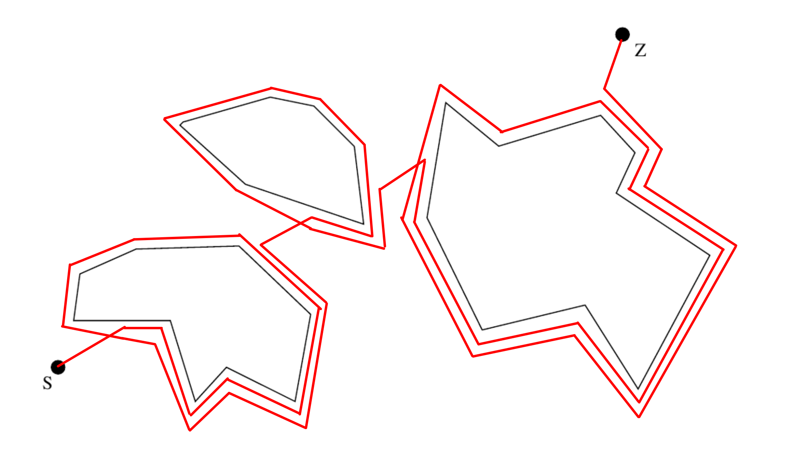
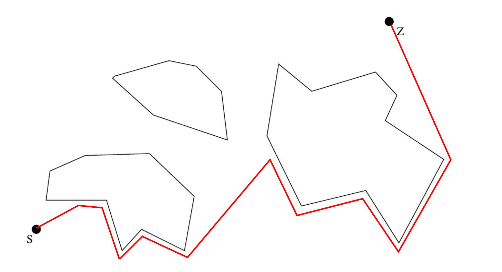
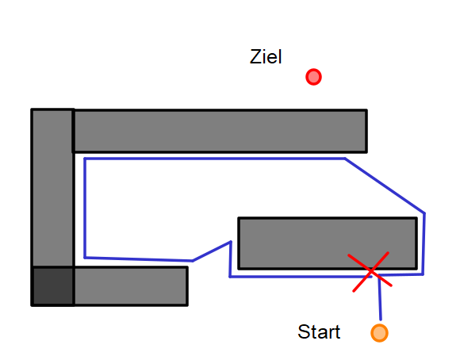

# Aufgabe 2

## a
Die Roboter fahren in unserem Fall immer rechts-herum

#### Bug 1
  

#### Bug 3
  

## b
  

## c
Für die Algorithmen muss bestimmt werden wie weit der Roboter von dem Ziel entfernt ist. Dafür muss die Position des Roboters und die Position des Ziels relativ zueinander bekannt sein. Dafür ist nicht zwangsläufig eine Karte notwendig, allerdings muss auch der Pfad den der Roboter bereits zurück gelegt hat irgendwie eingeordnet werden, wofür eine Karte sinnvoll wäre, welche aber auch relativ zur Startposition sein darf.
Es muss irgendwie möglich sein die Bewegung des Roboters zu bestimmen. Dafür lässt sich z. B. die Odometry verwenden, mit welcher sich die relative Roboterbewegung bestimmen lässt. (Dies wird benötigt um den zurückgelegten Pfad einzutragen und um den aktuellen Abstand zum Ziel zu bestimmen)
Ebenfalls muss der Roboter bestimmen können, ob dieser auf ein Hindernis trifft. Dafür eignet sich z. B. ein Laserscan, allerdings ließe sich dafür z. B. auch ein Abstandsensor mit Schall oder auch eine Stereokamera verwenden.

Mithilfe dieser Dinge lässt sich dann der Abstand vom Roboter zum Ziel bestimmen, bestimmen ob der Roboter gerade auf ein Hindernis trifft und ebenso welche Strecke der Roboter bereits zurückgelegt hat. All diese Dinge werden für die Algorithmen benötigt.