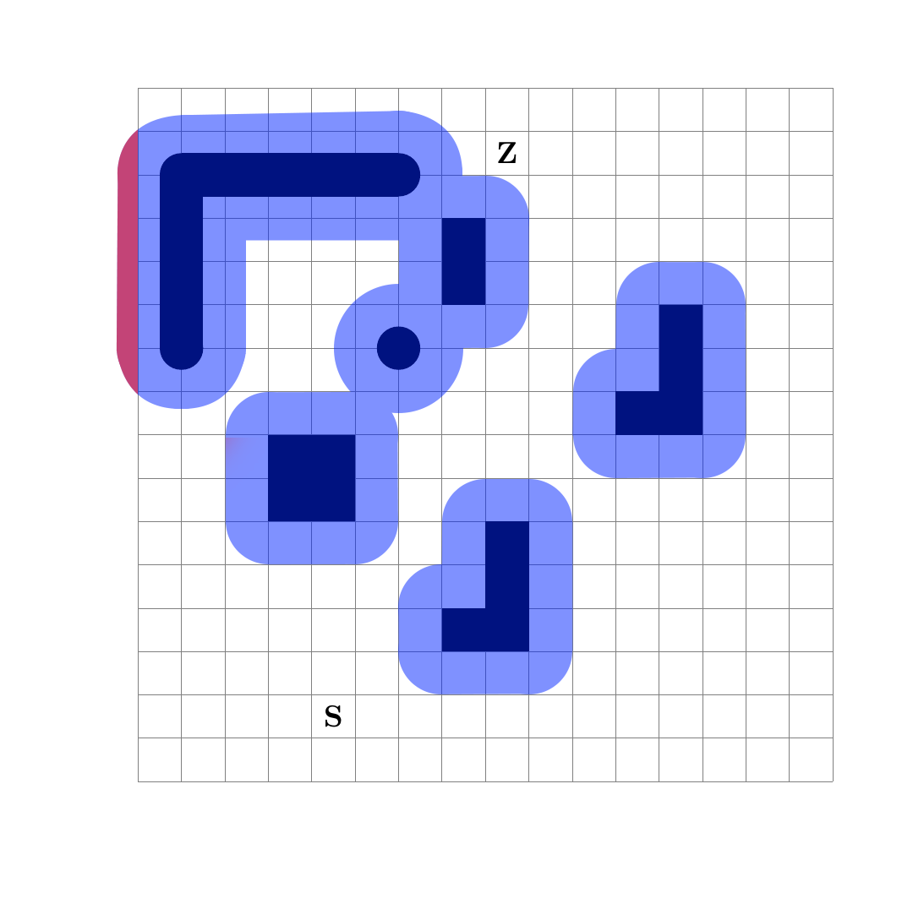
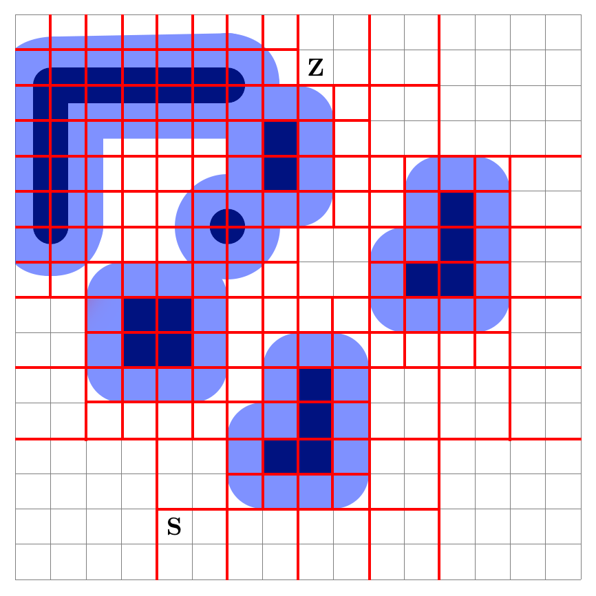
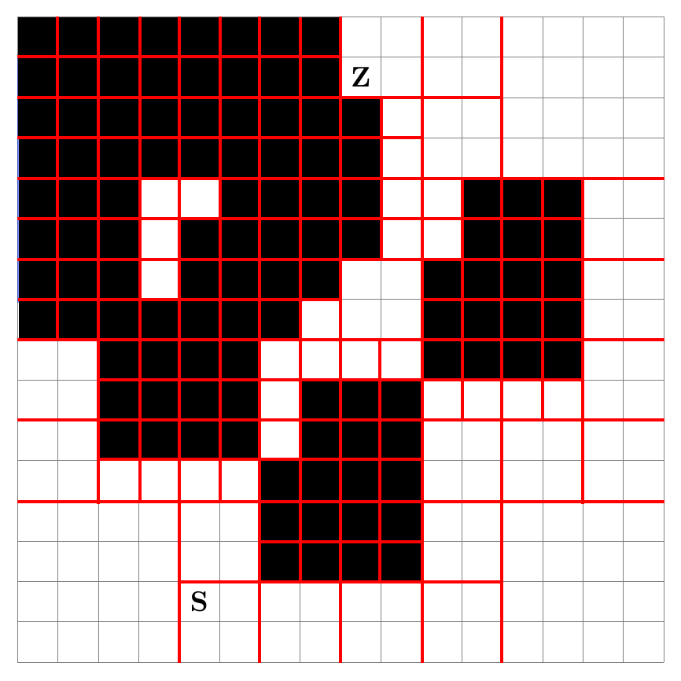
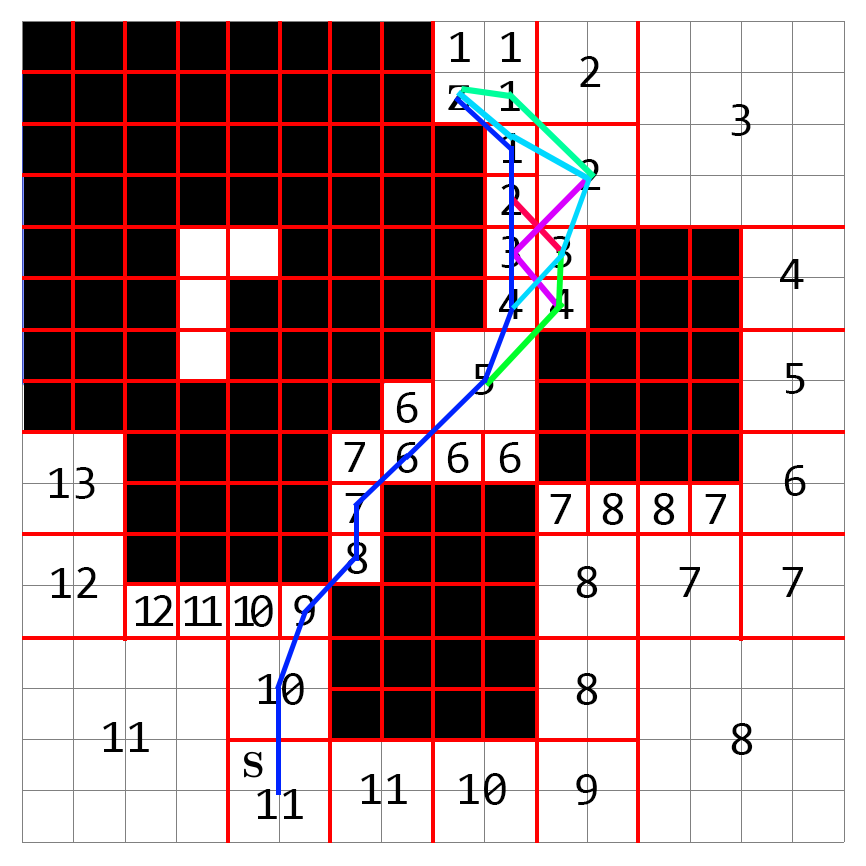

# Aufgabe 3

## a
  

## b

  
  

# c
  

Die kürzesten Pfade sind alle ähnlich gut befahrbar. Bei manchen Pfaden geht der Roboter häufiger ganz knapp an einer Ecke dran vorbei, wobei man davon ausgehen könnte, dass das vielleicht nicht erwünscht ist
Grundsätzlich macht das bei den kürzesten Pfaden aber kaum einen Unterschied.  
Bei den etwas längeren Pfaden hingegen gibt es einige (z. B. außen rechts herum), bei dem der Roboter deutlich weniger nah an den Hindernissen vorbei fahren müsste, was man als befahrbarer interpretieren könnte.

# d
Der Algorithmus geht normalerweise so vor, dass er auf einen aktuellen Feld steht und sich dann das Feld in seiner Nachbarschaft auswählt, welches den geringsten Wert hat. Ist diese nun (von z. B. einem Menschen) belegt, so kann dieser nicht auf dieses Feld fahren und somit dieses auch nicht auswählen.
Stattdessen könnte dieser dann das Feld mit dem zweiten geringsten Wert auswählen und damit seine Pfadplanung fortsetzen.
Führt das dazu, dass der Roboter sich irgendwann auf einem Feld befindet, auf welchen er sich nicht weiter bewegen kann, da um das aktuelle Feld herum nicht Felder mit höheren Wert als das aktuelle, nicht befahrbare Felder oder schon befahrende Felder vorhanden sind, so muss dieser eine Art Backtracking durchführen und von einer anderen Position einen anderen Weg auswählen.